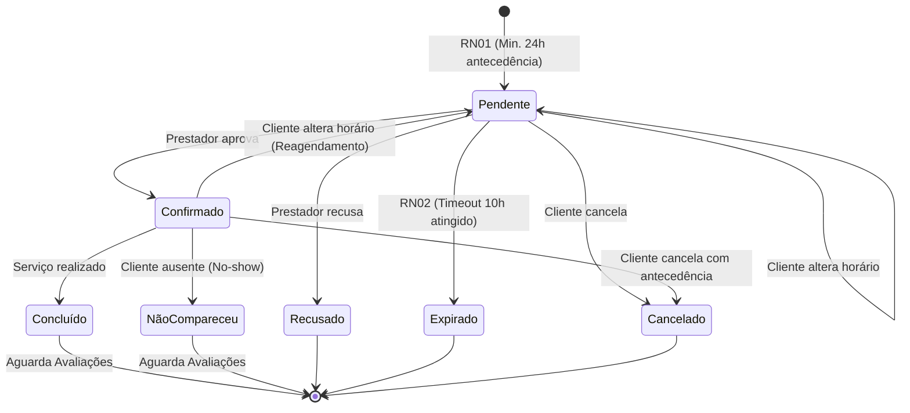
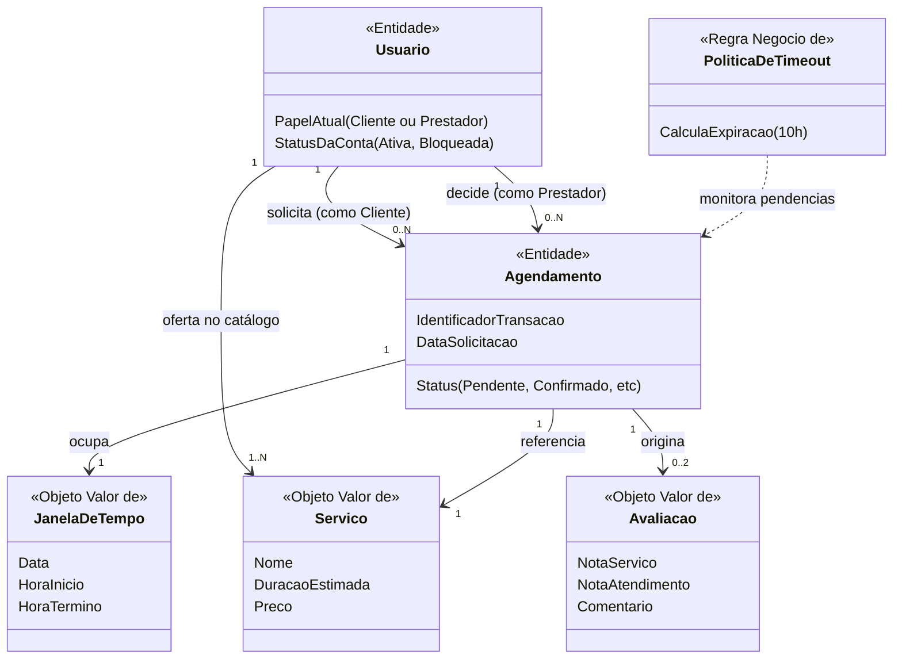

## 01. Apresentação e retomada do sistema

*   **Nome do sistema:** Sistema de Agendamento de Serviços (Salão, Clínica, Oficina).
*   **Problema central:** Pequenos e médios prestadores de serviços utilizam agendas manuais e aplicativos genéricos de mensagens. Essa dinâmica informal gera conflitos de horários, sobreposição de marcações, ausências sem aviso prévio (*no-shows*) e a total inexistência de um histórico centralizado de reputação.
*   **Contexto:** Ecossistema de prestadores de serviços de pequeno e médio porte (salões de beleza, clínicas e oficinas mecânicas, com foco estrito em diagnósticos). Carecem de soluções unificadas e lidam com desorganização operacional diária.
*   **Público/Atores principais:** O sistema possui um cadastro unificado, onde a entidade **Usuário** pode assumir dinamicamente o papel de *Cliente* (quem busca e reserva) ou o papel de *Prestador* (quem oferece a disponibilidade e atende).
*   **Objetivo da solução:** Atuar como um marketplace genérico e catálogo centralizado, garantindo a segurança das reservas por meio de um fluxo de aprovação com *timeout* matemático e um sistema comportamental de avaliações mútuas baseadas em qualidade.
*   **Fluxo principal analisado:** O Usuário (como Cliente) solicita a reserva com antecedência obrigatória mínima de 24 horas. O Usuário (como Prestador) possui um prazo limite de até 10 horas antes do evento para confirmar ou recusar o pedido. Se o cliente precisar, pode cancelar a reserva. Após o evento, o fluxo é encerrado com a avaliação bidimensional obrigatória (qualidade do serviço e do atendimento).
*   **Principais operações:** Buscar catálogo, Validar elegibilidade de agendamento (limites e antecedência), Criar solicitação, Cancelar reserva, Processar decisão do prestador, Expirar solicitação (*timeout*) e Registrar avaliação bidimensional.
*   **Principais informações:** O sistema precisa preservar o histórico unificado de reputação (para o *Hard Block*), o ciclo de vida da reserva (máquina de estados) e as janelas de tempo de disponibilidade.

## 02. Rastreabilidade do conhecimento anterior

A modelagem atual é uma evolução direta do conhecimento acumulado. A tabela abaixo demonstra de onde partem as decisões deste modelo conceitual:

| Elemento anterior | Descrição resumida | Como influencia a modelagem atual |
| :--- | :--- | :--- |
| **Decisão / Matriz DSC** | Cliente e Prestador classificados preliminarmente como Entidades, com a ressalva de que "se as regras forem idênticas, podem ser unificados". | Levou à decisão de unificar os atores na entidade `Usuário` com papéis dinâmicos, simplificando a identidade no domínio. |
| **Questão em Aberto (Q01)** | Qual o tempo exato de *timeout* para aprovação? | Resolvido: A regra agora exige agendamento com **24h de antecedência**, e o prestador tem até **10h antes** para confirmar. Isso molda as Invariantes temporais. |
| **Regra de Negócio** | O cliente pode solicitar vários agendamentos em dias diferentes. | Define a cardinalidade (1:N) e a restrição de negócio de limite de agendamentos simultâneos para a mesma data. |
| **Fato** | Prestador registra vários tipos de serviço. | Sustenta a relação obrigatória (1:N) entre o Usuário (papel Prestador) e os Serviços ofertados. |
| **Operação Nova** | O cliente pode cancelar ou alterar o horário da reserva. | Adiciona a transição "Cancelado" no diagrama de estados do Ciclo de Vida do Agendamento. |
| **Informação / Requisito** | A avaliação requer análise do "serviço" e do "atendimento". | O conceito de `Avaliação` deixa de ser um atributo simples e torna-se um Objeto de Valor multidimensional. |

## 03. Candidatos a conceitos do domínio

A partir dos fluxos e regras revisitadas, identificamos os seguintes candidatos que representam os pilares do funcionamento do domínio:

| Conceito candidato | De onde surgiu? | Por que parece relevante? | Grau de certeza |
| :--- | :--- | :--- | :--- |
| **Usuário** | Fluxo principal e Matriz inicial (fusão de Cliente/Prestador). | Centraliza a identidade. É quem age, sofre bloqueios, acumula reputação e transita entre papéis. | Certeza |
| **Agendamento** | Operação Principal de Reserva. | Representa a intenção formal e o compromisso temporal de atendimento entre as partes. É o núcleo do sistema. | Certeza |
| **Serviço** | Etapa de Escolha do Cliente / Catálogo. | Representa a promessa de valor que será executada (ex: diagnóstico automotivo, corte). | Certeza |
| **Avaliação** | Operação de conclusão pós-atendimento. | Mecanismo obrigatório de segurança sistêmica (reputação), composto pelas dimensões de *Serviço* e *Atendimento*. | Certeza |
| **Janela de Tempo** | Regras de bloqueio de concorrência. | O sistema precisa de uma coordenada matemática para evitar sobreposição de horários. | Certeza |
| **Status do Agendamento** | Controle de ciclo de vida. | Necessário para ditar as regras de negócio de acordo com a fase atual da reserva. | Certeza |
| **Timeout (10h/24h)** | Questão Q01 resolvida. | Regra temporal crítica que cancela solicitações pendentes órfãs para liberar a agenda. | Certeza |

## 04. Investigação de identidade

Antes de classificar os conceitos, é imperativo analisar se eles exigem identidade própria sistêmica para serem rastreados ao longo do tempo, ou se valem apenas pela informação que carregam:

| Conceito | Identidade parece relevante? | Evidência / justificativa | Classificação atual |
| :--- | :--- | :--- | :--- |
| **Usuário** | Sim | Os dados (telefone, endereço) podem mudar, mas o negócio precisa manter a reputação agregada vinculada à mesma pessoa física/jurídica continuamente. | Entidade |
| **Agendamento** | Sim | Possui um ciclo de vida dinâmico. O negócio precisa consultar "aquela reserva específica" para mudá-la de Pendente para Confirmada, ou para Cancelá-la. | Entidade |
| **Serviço** | Não | Importa apenas a composição de seus valores (Nome, Duração, Preço). Se um prestador oferece "Corte", a identidade lógica está no valor oferecido ao cliente. | Objeto de Valor |
| **Avaliação** | Não | Uma vez gerada, a avaliação é imutável. Importam apenas as notas (serviço e atendimento) e o comentário. Ela qualifica o usuário, não tem ciclo de vida próprio. | Objeto de Valor |
| **Janela de Tempo** | Não | Uma data e hora de início/fim (ex: "Dia 20, 14h às 15h") não muda de identidade; é apenas uma coordenada estática de tempo. | Objeto de Valor |
| **Status** | Não | Representa apenas uma classificação/estado temporário no qual o Agendamento se encontra. | Outro (Estado) |

## 05. Entidades, Objetos de Valor e outros conceitos

Com base na investigação de identidade e no significado estrutural, os candidatos foram classificados:

| Conceito | Classificação atual | Justificativa | Evidência | Grau de certeza |
| :--- | :--- | :--- | :--- | :--- |
| **Usuário** | Provável Entidade | Possui identidade única de cadastro. Sofre alterações de estado (bloqueio sistêmico) e age no domínio assumindo papéis distintos. | O negócio pune usuários específicos por *no-shows*. | Alto |
| **Agendamento** | Provável Entidade | Possui identidade transacional. A mesma reserva será alvo de operações de aprovação, cancelamento e posterior vínculo com a avaliação. | Necessidade de controle de concorrência e máquina de estados. | Alto |
| **Serviço** | Provável Objeto de Valor | Seu significado no domínio reside em seus atributos de negócio (tempo exigido, descrição, valor). Não transita de estado. | O cliente busca pelas características do serviço. | Médio |
| **Avaliação** | Provável Objeto de Valor | Não possui ciclo de vida próprio. Serve estritamente para compor a Reputação da entidade Usuário através de um valor consolidado. | A avaliação não é modificada após a submissão. | Alto |
| **Janela de Tempo** | Provável Objeto de Valor | Representa a coordenada temporal. Dois agendamentos na mesma janela acionam a Invariante de conflito. | Necessidade de checagem matemática de datas/horas. | Alto |
| **Status do Agendamento** | Outro (Estado) | Condição mutável que rege as transições válidas e o comportamento de bloqueio do Agendamento. | Fluxo do domínio. | Alto |
| **Timeout (Regras)** | Outro (Política/Regra) | Representa a Política de Negócio de expiração. Não armazena dados, é uma regra executada no domínio. | Definição das Invariantes. | Alto |

## 06. Casos de classificação ambígua

Para evidenciar que a modelagem não aplicou conceitos mecânicos, destacam-se dois casos que exigiram profunda investigação conceitual:

**Caso 1: A dualidade de Cliente e Prestador**
*   **Classificação inicial:** No início do projeto, *Cliente* e *Prestador* foram tratados como Entidades separadas.
*   **Dúvida encontrada:** Se ambos logam no sistema, ambos avaliam, e um profissional de salão pode ser cliente da oficina mecânica na mesma plataforma, não faria sentido no domínio duplicar a pessoa física.
*   **Alternativas e Evidências:** A equipe reavaliou as fronteiras e constatou que a identidade pertence ao "Usuário". Ser "Cliente" ou "Prestador" não é uma identidade estrutural permanente, mas sim o **papel (contexto)** assumido durante um Agendamento específico.
*   **Classificação atual:** Foi consolidado o conceito de Entidade **Usuário**.
*   **O que faria mudar:** Se o domínio de Prestador passasse a exigir CNPJ obrigatório, contrato de licenciamento, filiais e dados corporativos complexos inexistentes para o Cliente, seriam necessárias duas Entidades distintas.

**Caso 2: O Agendamento (De "Evento" para Entidade)**
*   **Classificação inicial:** Em debates primários, considerou-se que o Agendamento poderia ser classificado como "Outros conceitos".
*   **Dúvida encontrada:** Como controlar se o cliente desistisse da intenção horas depois? A matriz afirmava que agendamentos precisam ser únicos e possuem ciclo de vida.
*   **Alternativas e Evidências:** Tratar o agendamento apenas como uma intersecção temporal não sustentaria a riqueza operacional ("Cancelar", "Aprovar", "Expirar"). O negócio exige reconhecer a mesma solicitação ao longo dos dias.
*   **Classificação atual:** Entidade central do subdomínio de Reservas.
*   **O que faria mudar:** Se o sistema não garantisse o horário (fosse apenas um chat de intenções soltas sem bloqueio de agenda), o conceito deixaria de ter ciclo de vida controlado e não precisaria ser uma Entidade.

## 07. Relações entre conceitos

As conexões semânticas que permitem ao domínio funcionar:

| Conceito A | Relação | Conceito B | Significado no domínio | Evidência |
| :--- | :--- | :--- | :--- | :--- |
| **Usuário (papel Cliente)** | *solicita* | **Agendamento** | O cliente é o autor da intenção de reserva no catálogo. | Fluxo inicial de solicitação. |
| **Usuário (papel Prestador)** | *recebe / decide* | **Agendamento** | O prestador é o proprietário da agenda que sofre o bloqueio temporal e toma a decisão. | Etapa de decisão manual. |
| **Usuário (papel Prestador)** | *oferta* | **Serviço** | O prestador expõe a promessa de valor que ditará o tempo bloqueado. | Catálogo de Serviços. |
| **Agendamento** | *ocupa* | **Janela de Tempo** | A reserva precisa estar atrelada a uma coordenada matemática de início/fim para evitar sobreposições. | Regra de validação de conflito de agenda. |
| **Agendamento** | *origina* | **Avaliação** | O feedback está diretamente condicionado à ocorrência física do compromisso reservado. | Regra de reputação obrigatória. |

## 08. Cardinalidades

Quantificação estrutural baseada nas regras de negócio estabelecidas:

| Relação | Cardinalidade atual | Evidência | Grau de certeza |
| :--- | :--- | :--- | :--- |
| **Usuário (Cliente) ↔ Agendamento** | **1 : 0..N** | Um cliente pode ter zero ou vários agendamentos, mas o negócio exige que sejam em *dias diferentes* (evitar spam). | Confirmada. |
| **Usuário (Prestador) ↔ Agendamento** | **1 : 0..N** | O prestador recebe múltiplas intenções de reserva ao longo do tempo. | Confirmada. |
| **Usuário (Prestador) ↔ Serviço** | **1 : 1..N** | Para existir no catálogo, o prestador deve ofertar ao menos um serviço base. | Confirmada. |
| **Agendamento ↔ Janela de Tempo** | **1 : 1** | Toda reserva necessita obrigatoriamente de exatamente um período de início e fim. | Confirmada. |
| **Agendamento ↔ Avaliação** | **1 : 0..2** | Uma reserva gera no máximo 2 avaliações (uma do cliente, uma do prestador), ou 0 se for cancelada/expirada. | Confirmada. |

## 09. Regras de Negócio

Conhecimento de domínio que dita o comportamento sistêmico, documentado através de condições:

| ID | Regra de Negócio | Conceitos envolvidos | Origem / evidência | Situação |
| :--- | :--- | :--- | :--- | :--- |
| **RN01** | O Agendamento somente pode ser criado se a Janela de Tempo solicitada estiver a pelo menos **24 horas** de distância do instante atual da solicitação. | Agendamento, Janela de Tempo | Resolução do problema de cancelamentos em cima da hora. | Confirmada |
| **RN02** | O sistema considerará um Agendamento "Expirado" (Timeout) se o Prestador não registrar aprovação até **10 horas antes** do início da Janela de Tempo. | Agendamento, Timeout | Evita que o prestador confirme quando o cliente não tem mais tempo hábil para se programar. | Confirmada |
| **RN03** | Um Cliente não pode possuir mais de um Agendamento (em qualquer estado ativo) referenciando a mesma data no calendário. | Usuário, Agendamento | Restrição antifraude consolidada. | Confirmada |
| **RN04** | A Avaliação submetida deverá ser bidimensional, obrigatoriamente pontuando a *Qualidade do Serviço* e o *Atendimento*. | Avaliação, Agendamento | Decisão de negócio para garantir granularidade na reputação. | Confirmada |

## 10. Invariantes e proteção da consistência

Condições que, se rompidas, deixam o domínio em um estado logicamente inválido:

| Conceito protegido | Possível invariante | O que poderia violá-la? | Consequência | Evidência |
| :--- | :--- | :--- | :--- | :--- |
| **Agenda do Prestador** | **Invariante de Concorrência:** Duas reservas com status "Pendente" ou "Confirmado" referenciando o mesmo Prestador nunca podem possuir Janelas de Tempo que se sobreponham. | Falha no controle transacional durante cliques simultâneos de dois clientes. | Overbooking (dois clientes no mesmo horário), destruindo a confiança no sistema. | Fato original do problema de agendas manuais. |
| **Avaliação** | **Invariante de Estado Final:** Uma Avaliação só pode ser instanciada se o Agendamento ao qual ela se refere estiver estritamente no estado "Concluído" ou "Não Compareceu". | O sistema permitir que a tela de feedback abra enquanto a reserva ainda está "Pendente". | Falsificação de reputação sem que o atendimento tenha ocorrido. | Ciclo de vida estrito. |
| **Agendamento** | **Invariante Temporal:** O prazo de expiração (Timeout de 10h) deve ser matematicamente sempre menor que o prazo mínimo de antecedência da criação (24h). | Mudança arbitrária de configurações (ex: reduzir antecedência para 5h, mas manter timeout em 10h). | O Agendamento expiraria antes mesmo de ser criado. | RN01 e RN02 matemáticas. |

## 11. Estados e ciclo de vida

O ciclo de vida da Entidade central do sistema (Agendamento), demonstrando as transições de estado mapeadas pelas regras de negócio.

**Explicação do Ciclo de Vida:** O sistema blinda o estado `Pendente` exigindo as 24 horas de antecedência. Enquanto está pendente, pode ser aceito, ativamente recusado, abandonado pelo prestador (ativando a transição temporal `Expirado`), ou `Cancelado` ativamente pelo cliente. Apenas reservas que passam pelo gargalo de `Confirmado` podem atingir os estados terminais que geram direito a Avaliação (`Concluído` ou `NãoCompareceu`).

## 12. Primeiro Modelo Conceitual do sistema

Representação integrada do domínio identificada na etapa atual, focada no negócio, sem representações de infraestrutura, bancos de dados, FKs ou atributos técnicos.

## 13. Explicação do Modelo Conceitual

*   **Por que cada conceito está presente:** O modelo garante a coesão do marketplace. O `Usuario` centraliza as punições e a identidade. O `Agendamento` é o orquestrador transacional. O `Servico` e a `JanelaDeTempo` fornecem as condições físicas da reserva. A `Avaliacao` é a governança garantidora da segurança do ecossistema.
*   **Identidade vs. Objetos de Valor:** Apenas `Usuario` e `Agendamento` foram modelados como Entidades, pois são as únicas peças que sofrem transições no tempo (como os bloqueios e cancelamentos). `Servico`, `JanelaDeTempo` e `Avaliacao` foram encapsulados como Objetos de Valor pois importam estritamente pela integridade dos dados que carregam, sem ciclos de vida autônomos.
*   **Relações mais importantes:** As duas setas partindo de `Usuario` para `Agendamento` sustentam a eliminação da dualidade Cliente/Prestador, demonstrando que uma única identidade atua nos dois pólos da transação assumindo papéis.
*   **Regras impactantes:** A `PoliticaDeTimeout` está representada de forma desacoplada monitorando o Agendamento, ilustrando fisicamente a Invariante das "10 horas antes" (RN02).

## 14. Evolução do modelo

Como o conhecimento se consolidou e refinou o modelo atual:

| Momento | Alteração realizada | Motivo | Evidência ou descoberta que provocou a mudança |
| :--- | :--- | :--- | :--- |
| **Identificação Inicial** | Cliente e Prestador eram Entidades isoladas. | Redução de duplicidade e coesão de identidade. | Análise da matriz DSC: A pessoa física é a mesma, só o papel no agendamento muda. |
| **Regras (Tempo)** | Questão de tempo em aberto definida para 24h e 10h. | Necessidade de Invariantes matemáticas testáveis. | O *timeout* precisava ser menor que a antecedência para evitar estados inválidos. |
| **Regras (Limite)** | Criação da regra de "1 por dia". | Prevenir ataques e spam na agenda dos prestadores. | Necessidade de proteger o bloqueio temporário (Pendente) de usuários mal-intencionados. |
| **Refinamento do VO** | Avaliação passou a ser bidimensional (Serviço + Atendimento). | Oferecer métricas mais justas ao prestador (o corte foi bom, mas o salão atrasou). | Nova requisição de negócio documentada. |

## 15. Revisões identificadas em relação aos documentos anteriores

As seguintes revisões foram identificadas nos artefatos passados que fundamentaram este trabalho:

| Documento ou conhecimento anterior | Revisão identificada | Motivo | Impacto futuro |
| :--- | :--- | :--- | :--- |
| **Matriz DSC / Proposta Inicial** | Atualizar a separação estrita de Entidades (Cliente/Prestador) para o modelo unificado de Usuário com papéis. | Identidade única no domínio. | Mudará completamente os fluxos de autenticação e os modelos do banco de dados na fase técnica. |
| **Hipótese Q01 (Quadro de Fatos)** | A questão sobre o tempo exato de *timeout* deve ser fechada. | O domínio resolveu a matemática. | As regras de 24h/10h deverão ser incluídas na documentação definitiva de requisitos. |

## 16. Pendências de governança

Itens que não foram atualizados agora, mas que requerem alinhamento futuro:

| Item a revisar futuramente | Motivo | Prioridade | Consequência se permanecer desatualizado |
| :--- | :--- | :--- | :--- |
| **Diagrama Arquitetural Inicial** | Reflete "Cliente" e "Prestador" como domínios isolados. | Alta | A equipe de desenvolvimento criará cadastros duplicados erroneamente. |
| **Tabela de Atores** | O conceito de "Usuário com Papéis dinâmicos" precisa ser inserido na tabela. | Média | Confusão na gestão de acesso (*permissions*). |

## 17. Análise crítica do modelo

Respondendo às provocações críticas sobre a estabilidade do domínio:

1.  **Qual parte do modelo possui melhor sustentação?** O Ciclo de Vida do `Agendamento` e a `JanelaDeTempo`. Suas transições e invariantes são lógicas, matemáticas e essenciais para a prevenção de *overbooking*.
2.  **Qual conceito possui classificação mais incerta?** O Serviço. Embora modelado como Objeto de Valor hoje, se no futuro o sistema decidir que Serviços precisam de "versões", "promoções sazonais" ou "histórico de preços", ele será forçado a virar uma Entidade.
3.  **Qual relação possui justificativa mais frágil?** Agendamento → Avaliação (1 : 0..2). Ela é frágil porque assume que o fluxo só "termina" moralmente com o feedback, mas sistemicamente é difícil garantir as duas notas.
4.  **Qual cardinalidade ainda precisa de validação?** O limite antifraude (1 agendamento por dia para o cliente). Pode ser muito restritivo para clientes legítimos que desejam ir a um salão e depois a uma oficina no mesmo dia.
5.  **Qual regra possui maior impacto?** As regras temporais RN01 e RN02 (24h/10h). Todo o processamento em lote (*cron job*) e sistema assíncrono dependerá dessa matemática de domínio.
6.  **Decisão baseada em intuição?** O bloqueio comportamental sistêmico (*Hard block*). Intui-se que o usuário valoriza a plataforma o suficiente para avaliar; se a plataforma não tiver tração, ele simplesmente abandonará o app em vez de avaliar.
7.  **Hipótese que provocaria maior mudança:** Se rejeitarem a ideia de que "Não processaremos pagamentos". A inclusão de transações financeiras mudaria os Status, exigiria Entidades de Faturamento, Estornos e Invariantes financeiras severas.
8.  **Nova informação que mudaria o modelo:** Se as clínicas exigissem a separação do Agendamento por "Sala" e "Equipamento", não apenas por Prestador. A `JanelaDeTempo` precisaria envolver controle de recursos físicos.
9.  **Parte a ser revisada futuramente:** A granularidade da `Avaliacao`.
10. **Contradição existente?** A dualidade de Cliente e Prestador ainda existe nominalmente no repositório antigo, o que agora entra em contradição com o conceito unificado de Usuário proposto aqui.

## 18. Reflexão da equipe

Conclusões extraídas da jornada de modelagem:

*   **Descoberta:** Percebemos que o domínio não tratava de "dois tipos de pessoas", mas sim de uma única pessoa física/jurídica vestindo chapéus diferentes (papéis).
*   **Mais difícil de classificar:** O `Agendamento`. Havia uma confusão entre considerar um agendamento como um "Evento momentâneo" ou como algo com "Ciclo de Vida próprio".
*   **Discussão de relações:** O fluxo de "Cancelado pelo Cliente", que reinicia o status da reserva sem ferir o bloqueio anterior.
*   **Simples que virou Entidade:** O Agendamento, inicialmente considerado por alguns como "apenas uma linha na agenda", provou ser o coração da máquina de estados do sistema.
*   **Entidade que deixou de ser necessária:** `Cliente` e `Prestador`, absorvidos pelo `Usuário`.
*   **Cardinalidade presumida:** A limitação de "apenas 1 por dia" surgiu como hipótese antifraude técnica, precisando de observação do Produto.
*   **Regra de maior influência:** O *timeout* matemático (10h) travado logicamente contra a antecedência (24h) governou o ciclo temporal do domínio.
*   **Revisão essencial:** Os fluxogramas iniciais do projeto que retratam tabelas de Cliente distintas.
*   **O que mudou na compreensão:** O entendimento de que infraestrutura (como banco de dados) é cega às regras de negócio. O modelo agora traduz a *lógica real* de forma agnóstica.
*   **Estamos preparados?** Sim. O modelo atual eliminou a ambiguidade temporal e definiu identidades claras, garantindo as Invariantes necessárias para avançarmos para a separação em Contextos Limitados (*Bounded Contexts*) de software.

---

## 19. Apêndice: Uso de Inteligência Artificial

**Ferramenta utilizada:**
Google Gemini (LLM).

**Finalidade:**
A IA foi utilizada estritamente como *sparring* analítico, ferramenta de questionamento investigativo e suporte na formulação semântica dos diagramas Mermaid. Não foi utilizada como geradora autônoma de regras de negócio.

**Contribuições relevantes:**
*   A IA ajudou a tensionar a contradição inicial da equipe sobre classificar o Agendamento como um "Outro conceito" ao mesmo tempo que afirmávamos que ele precisava "ser único e ter ciclo de vida", forçando a consolidação como Entidade.
*   Auxiliou na formulação da regra matemática exata do *timeout* (impedindo a ocorrência de expirações inválidas se a regra de criação e de recusa não estivessem temporalmente encadeadas).

**Hipóteses reveladas:**
A regra do "limite de 1 agendamento por dia" foi revelada como uma hipótese (RN03) que poderia engessar clientes bons que precisam de dois serviços distintos na mesma data. Isso ficará sob observação do time de Produto.

**Classificações questionadas:**
O uso da IA ajudou a questionar a existência paralela de `Cliente` e `Prestador`. O debate revelou que a Identidade pertence ao Usuário, e o contexto de uso dita o seu papel.

**Avaliação crítica:**
*   **Onde ajudou:** Na rigorosa filtragem de jargões técnicos de banco de dados (garantindo que o foco ficasse em Objetos de Valor e Entidades puras do domínio) e na geração sintática correta dos diagramas visuais do Mermaid.
*   **Limitações:** A IA não possui o contexto das entrevistas ou das dores reais do mercado (oficinas e salões), necessitando que todas as regras fossem informadas e guiadas humanamente.
*   **Como sugestões foram verificadas:** Todas as relações de cardinalidade e invariantes temporais propostas ou refinadas com a IA foram lidas, testadas logicamente em quadros brancos pela equipe e cruzadas com a matriz DSC para validação.

**Questão final obrigatória:** *Se a IA fosse retirada agora, a equipe conseguiria explicar, justificar e defender cada elemento do modelo conceitual produzido? Justifique.*
**Resposta:** Sim. Todo o modelo foi construído com base em deliberações e material previamente produzido pela equipe (a exclusão de pagamentos, o *timeout* de 24h/10h, a dualidade dos papéis do usuário). A ferramenta atuou apenas para dar robustez metodológica (DDD - Domain Driven Design) à nossa documentação. Os integrantes são os detentores exclusivos das regras do domínio.