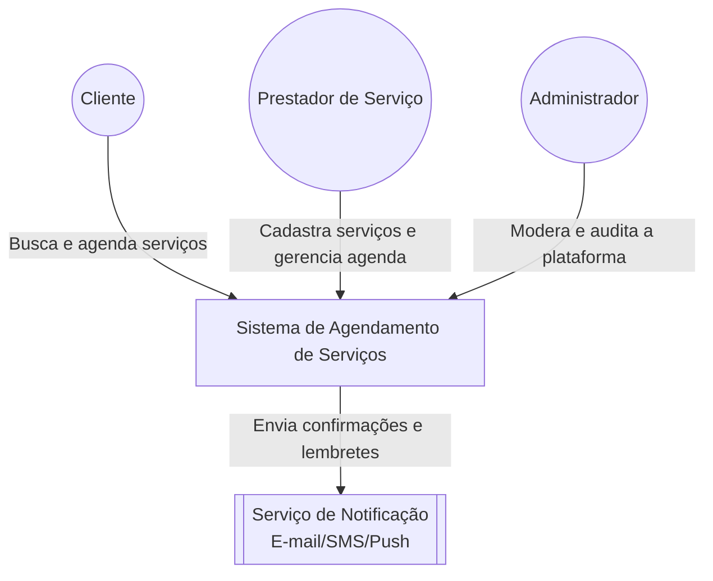
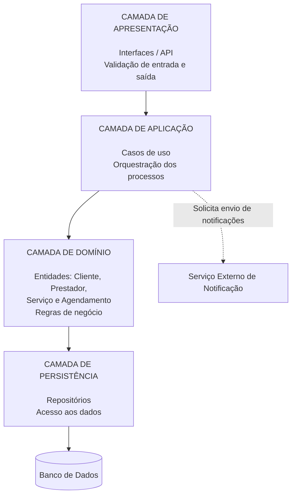
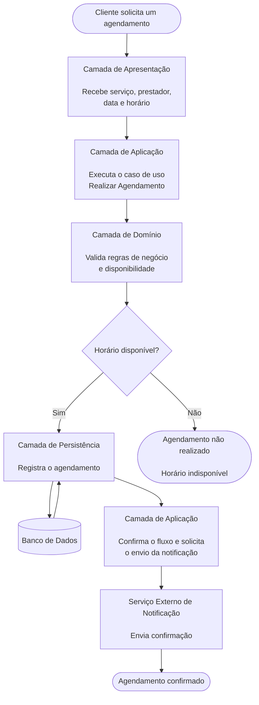
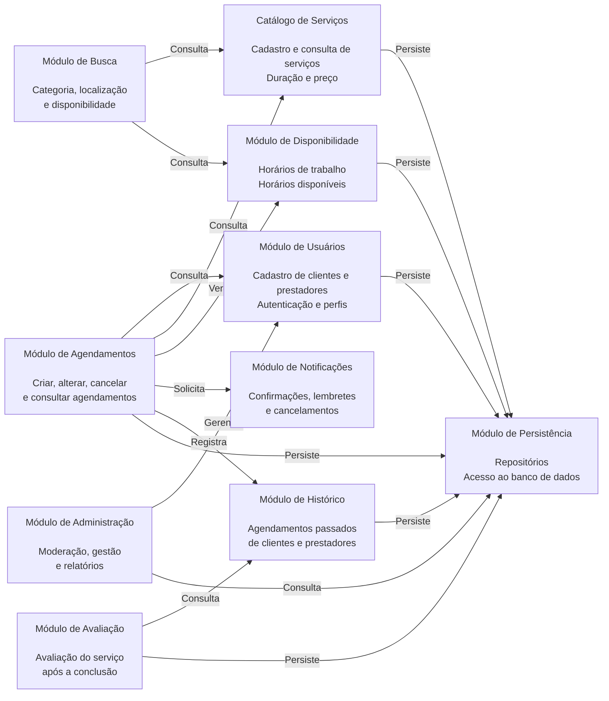

# *Desenvolvimento de Sistemas Corporativos*

### Alunos:
- Guilherme Campos Feuser
- Layssa Rodrigues Alves
- João Pedro Zanette Sartori

## *Tema:* Sistema de Agendamento de Serviços (Salão, Clínica, Oficina)

### *Objetivos do Trabalho:*
- Compreender um domínio de problema;
- Identificar atores e necessidades;
- Decompor um sistema em módulos;
- Propor uma organização arquitetural coerente;
- Refletir sobre decisões arquiteturais.

### *Descrição do problema:*

#### Qual problema o sistema resolve? Qual o contexto de uso? Quais necessidades motivam a criação da plataforma?

Um Sistema de Agendamento de Serviços é necessário para controlar a agenda de um prestador de serviços de maneira facilitada e centralizada. Ele é utilizado para cadastrar o tipo de serviço que o prestador oferece, os horários disponíveis e seus valores; com isso, o cliente que deseja agendar um serviço visualiza essas informações e realiza o agendamento. Em alguns casos, também é possível realizar uma parte do pagamento (sinal) para que o agendamento seja efetivado, além de notificar o prestador sobre a nova reserva.

O contexto de uso é o dia a dia de pequenos e médios negócios de prestação de serviços — salões de beleza, clínicas e oficinas mecânicas — que hoje dependem de agendas manuais, cadernos ou aplicativos de mensagem para controlar horários, o que gera conflitos, esquecimentos e falta de histórico organizado.

A plataforma se justifica pela necessidade de centralizar essas informações, evitar conflitos de horário, dar visibilidade em tempo real da agenda ao prestador e facilitar, para o cliente, a busca e a reserva de horários sem depender de contato telefônico.

### Identificação dos Atores

| Ator | Papel | Como interage com o sistema |
|---|---|---|
| **Cliente** | Usuário que busca e reserva serviços | Consulta serviços e horários, realiza agendamentos, efetua pagamento/sinal, avalia o serviço prestado |
| **Prestador de Serviço** | Profissional ou estabelecimento que oferece o serviço | Cadastra serviços, define horários disponíveis e valores, gerencia sua agenda, confirma ou cancela agendamentos |
| **Administrador** | Responsável pela gestão da plataforma | Gerencia prestadores cadastrados, realiza moderação e consulta relatórios internos |
| **Sistema de Pagamento (externo)** | Serviço externo integrado | Processa pagamentos e sinais, retorna confirmação de transação |
| **Sistema de Notificação (externo)** | Serviço externo integrado | Envia e-mails/SMS/push de confirmação, lembrete e cancelamento |

### Módulos do Sistema

| Módulo | Responsabilidade |
|---|---|
| **Gestão de Usuários** | Cadastro, autenticação e autorização de clientes e prestadores |
| **Catálogo de Serviços** | Cadastro dos serviços oferecidos por cada prestador (tipo, duração, preço) |
| **Busca** | Permite ao cliente localizar prestadores/serviços por categoria, localização e disponibilidade |
| **Agendamento** | Núcleo do sistema; controla criação, alteração e cancelamento de reservas, validando conflitos de horário |
| **Pagamentos** | Processa sinal/pagamento do agendamento, integrando-se a um gateway externo |
| **Avaliação** | Permite ao cliente avaliar o serviço prestado após a conclusão |
| **Histórico** | Mantém o registro de agendamentos passados de clientes e prestadores |
| **Notificações** | Dispara confirmações, lembretes e avisos de cancelamento |
| **Administração** | Gestão de prestadores cadastrados, moderação e relatórios internos |

A divisão foi pensada para isolar a regra mais sensível do domínio (o Agendamento) dos módulos de apoio (Pagamentos, Notificações, Avaliação), que podem evoluir ou ser substituídos sem impactar a lógica central de reservas.

### Arquitetura em Camadas

-  **Camada de Apresentação:** Responsável por interagir com o usuário, contendo telas de serviços disponíveis, horários, profissionais responsáveis, cadastro e acompanhamento dos agendamentos. Também realiza validações básicas de entrada e saída de dados, como campos obrigatórios, formatos de data e horário e informações de cadastro.

- **Camada de Aplicação:** Responsável por coordenar as operações realizadas pelo sistema, recebendo as solicitações da camada de apresentação e acionando os componentes necessários para executá-las. Controla os fluxos dos casos de uso, como realizar, alterar e cancelar agendamentos, consultar horários disponíveis e cadastrar serviços.

- **Camada de Domínio:** Responsável por representar os elementos e as regras do negócio relacionados ao agendamento de serviços. Contém entidades como Cliente, Prestador, Serviço e Agendamento, além das regras que determinam, por exemplo, que um prestador não pode possuir dois agendamentos no mesmo horário, que um horário precisa estar disponível para ser reservado e que um agendamento cancelado não pode ser considerado como ativo.

- **Camada de Persistência:** Responsável por realizar a comunicação com o banco de dados, permitindo armazenar, consultar, alterar e excluir informações do sistema. Nessa camada são persistidos dados como clientes, prestadores, serviços, horários disponíveis e agendamentos. Ela também é responsável por recuperar essas informações quando solicitadas pela camada de aplicação.

## Diagramas

- ### **Diagrama de Ecossistema**

- ### Diagrama Arquitetural

- ### Diagrama de Fluxo do Sistema (REALIZAR AGENDAMENTO)

- ### Diagrama de Módulos

## Reflexão e Decisões Arquiteturais
#### Organização inicial do sistema
O sistema seria inicialmente **monolítico modular**, organizado internamente pelas camadas descritas (apresentação, aplicação, domínio e persistência), e não distribuído em microsserviços.

Essa escolha se justifica porque:
- **Domínio:** o domínio de agendamento, embora tenha regras sensíveis (conflito de horários), não é grande o suficiente para exigir times e serviços independentes;
- **Tamanho inicial do sistema:** trata-se de um MVP, com poucos módulos e volume de dados ainda incerto;
- **Atributos de qualidade:** consistência é mais crítica do que escalabilidade extrema nesta fase — um monólito facilita transações consistentes ao validar e confirmar um agendamento;
- **Equipe:** equipe pequena (3 integrantes), o que tornaria o overhead operacional de microsserviços (deploy, comunicação entre serviços, observabilidade distribuída) desproporcional ao benefício;
- **Complexidade operacional:** um monólito modular é mais simples de manter, testar e implantar nesta fase;
- **Possibilidade de evolução:** como os módulos já são bem delimitados (Agendamento, Pagamentos, Notificações, etc.), a arquitetura permite, no futuro, extrair módulos específicos (por exemplo, Pagamentos ou Notificações) para serviços independentes, caso a demanda justifique.

#### Módulo de maior complexidade
O módulo de **Agendamento** é o que apresenta maior complexidade e sensibilidade arquitetural. Isso ocorre porque ele concentra as principais regras de negócio (impedir sobreposição de horários para um mesmo prestador, validar disponibilidade, tratar cancelamentos) e depende de múltiplos outros módulos para ser concluído (Catálogo de Serviços, Pagamentos e Notificações). Além disso, é o módulo mais suscetível a problemas de concorrência, já que dois clientes podem tentar reservar o mesmo horário simultaneamente.

#### Desafios técnicos e arquiteturais
1. **Consistência/Concorrência:** garantir que dois clientes não consigam reservar o mesmo horário com o mesmo prestador ao mesmo tempo (condição de corrida no momento da confirmação do agendamento).
2. **Integração:** depender de um gateway de pagamento externo para confirmar o sinal do agendamento, lidando com falhas, timeouts ou indisponibilidade desse serviço.
3. **Disponibilidade:** manter a consulta de horários disponíveis sempre atualizada e responsiva, mesmo em horários de pico de acesso (ex.: início do dia, quando vários clientes consultam agendas ao mesmo tempo).
4. **Escalabilidade:** suportar o crescimento do número de prestadores e clientes sem degradar o tempo de resposta da busca e do agendamento.

#### Resposta arquitetural aos desafios
A separação em camadas ajuda a isolar a regra de conflito de horário na camada de Domínio, tornando-a testável e independente da tecnologia de apresentação ou persistência escolhida. A validação de disponibilidade sempre passa pela camada de Domínio antes da persistência, reduzindo o risco de inconsistência. Além dessa validação, o banco de dados deverá utilizar transações e restrições de integridade para impedir que dois agendamentos para o mesmo prestador e horário sejam confirmados simultaneamente. A integração com pagamento e notificação foi isolada em módulos próprios, de forma que uma falha nesses serviços externos não comprometa diretamente o núcleo do domínio (pode-se, por exemplo, registrar o agendamento como "pendente de pagamento" caso o gateway esteja indisponível).

Ainda assim, algumas limitações permanecem: o controle de concorrência em alta escala exigiria mecanismos adicionais (como bloqueio otimista ou filas de processamento) que não são resolvidos apenas pela organização em camadas; e a arquitetura monolítica, embora adequada agora, exigirá revisão caso o volume de acessos cresça significativamente.

## ADR-001 — Decisão Arquitetural Inicial

### Contexto
**Qual situação ou necessidade exige uma decisão?**

O sistema de agendamento precisa gerenciar clientes, profissionais, serviços, horários e reservas. Também deve evitar conflitos, como dois clientes agendarem o mesmo profissional no mesmo horário.

### Decisão
**Qual escolha arquitetural foi realizada?**

Será utilizada uma **arquitetura monolítica modular organizada em camadas**, separando responsabilidades de apresentação, aplicação, domínio e persistência. Os módulos, como usuários, serviços, agendamentos, pagamentos e notificações, permanecerão na mesma aplicação, mas com responsabilidades bem definidas. A API REST e o banco de dados relacional serão escolhas complementares de implementação.

### Alternativas consideradas
**Quais outras possibilidades foram avaliadas?**

Foram avaliados:
- **Microserviços**, que permitiriam maior independência entre partes do sistema, mas aumentariam a complexidade de desenvolvimento, implantação e comunicação entre serviços.
- **Monólito tradicional**, que seria simples inicialmente, porém teria menor separação de responsabilidades e poderia dificultar a manutenção conforme o sistema evoluísse.

### Justificativa
**Por que a decisão foi considerada adequada?**

A arquitetura escolhida oferece uma boa combinação entre simplicidade, organização e facilidade de manutenção, sendo adequada para o tamanho inicial do sistema.

### Benefícios esperados
**Quais ganhos são esperados?**

Espera-se ter:
- Desenvolvimento e manutenção mais simples
- Boa organização do código
- Consistência dos dados
- Menor custo e complexidade de infraestrutura
- Facilidade para evoluir o sistema futuramente

### Riscos e consequências aceitas
**Quais limitações, custos ou riscos acompanham a decisão?**

Com o crescimento do sistema, o monólito pode ficar mais complexo e difícil de escalar. Porém, a divisão em módulos facilita uma futura migração de partes do sistema para serviços independentes, caso necessário.

## Funcionalidade Inovadora

**Funcionalidade proposta:** transformar a plataforma em um **marketplace genérico de agendamento**, no qual qualquer tipo de prestador de serviço (salão, clínica, oficina, personal trainer, esteticista, etc.) possa se cadastrar e disponibilizar sua própria agenda, em vez de o sistema atender a um único segmento fixo.

**Necessidade do domínio que ela atende:**
Hoje, negócios de segmentos diferentes usam soluções isoladas (uma para salões, outra para clínicas). Um sistema genérico reduz a fragmentação, permite que o cliente encontre diferentes tipos de serviço em um único lugar e facilita a entrada de novos segmentos sem exigir uma nova plataforma.

**Onde ela se encaixa na arquitetura:**
- O **Catálogo de Serviços** passa a suportar categorias configuráveis (ex.: "Beleza", "Saúde", "Automotivo"), em vez de campos fixos por segmento;
- O módulo de **Busca** passa a permitir filtro por categoria, localização e tipo de serviço;
- O módulo de **Gestão de Usuários** poderá permitir requisitos de cadastro específicos conforme a categoria do prestador, sem alterar a estrutura principal do sistema;
- A camada de **Domínio** precisa generalizar a entidade Serviço, mantendo apenas os atributos comuns a todos os segmentos (duração, valor, disponibilidade) e permitindo atributos específicos por categoria de forma extensível.

**Atores beneficiados:** Cliente (mais opções em um único lugar) e Prestador (acesso a uma base maior de clientes, independentemente do segmento).

**Consequências arquiteturais:** aumenta a complexidade do Catálogo e da Busca (que passam a lidar com atributos variáveis por categoria), mas não exige mudança na organização em camadas nem no núcleo de regras do Agendamento.

## Considerações Finais

O desenvolvimento deste trabalho permitiu compreender melhor o domínio de um Sistema de Agendamento de Serviços, identificando seus principais atores, necessidades, módulos e desafios arquiteturais. O sistema foi pensado para atender diferentes tipos de prestadores, como salões, clínicas e oficinas, centralizando serviços, horários e agendamentos e reduzindo problemas como conflitos de agenda e falta de organização.

A arquitetura escolhida foi monolítica modular e organizada em camadas, separando apresentação, aplicação, domínio e persistência. Essa escolha busca manter o sistema simples de desenvolver e manter, sem deixar de permitir uma evolução futura caso o número de usuários e serviços aumente.

O módulo de Agendamento foi identificado como o ponto mais importante e complexo do sistema, principalmente por precisar garantir a disponibilidade dos horários e evitar que dois clientes reservem o mesmo horário simultaneamente.

Assim, as decisões arquiteturais tomadas procuram equilibrar simplicidade, organização, consistência dos dados e possibilidade de evolução, criando uma base adequada para o desenvolvimento inicial do sistema.
